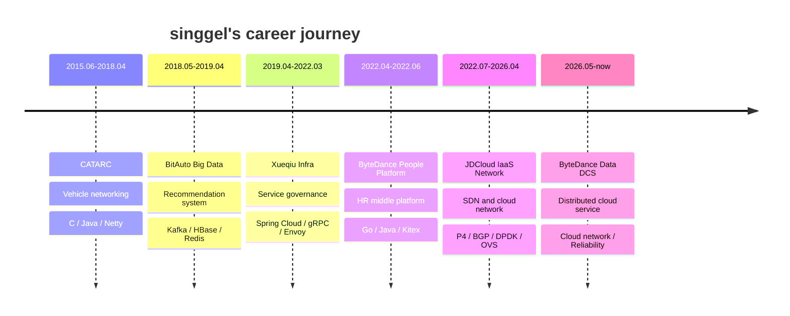

<!--
Profile README generated from local sources:
- notify/README.md and notify/resume.md for career milestones
- bgw, igw, iaas-network, ops, AI-Agent-Test README/git history for project milestones
Sensitive contact details from resume.md were intentionally excluded.
-->

# Hi, I'm singgel 👋

阿拉斯加大闸蟹 · Infrastructure / Cloud Network / Backend Engineering

I focus on large-scale infrastructure, cloud networking, distributed systems, high availability, and engineering knowledge sharing.

- 🌐 Cloud network: VPC / NAT / LB / BGP / IPv6 / VPN / private connectivity
- 🚀 Data plane: DPDK / OVS / P4 / Barefoot-Tofino / programmable gateway
- 🧩 Backend: Java / Go / Spring Cloud / Redis / Kafka / MySQL
- 🛡️ Reliability: traffic governance, multi-IDC consistency, failover, observability, RCA
- ✍️ Long-term notes: architecture, infrastructure, learning methods, career reflection

## Career Journey



## Personal Timeline Details

| Period | Organization / Focus | Highlights | Stack |
| --- | --- | --- | --- |
| 2015.06-2018.04 | CATARC | Vehicle networking and distributed backend foundations | C / Java / Netty / MySQL |
| 2018.05-2019.04 | BitAuto Big Data | Recommendation system refactoring and data pipeline work | Java / Kafka / HBase / Redis |
| 2019.04-2022.03 | Xueqiu Infrastructure | Spring Cloud governance, middleware platform, observability and infra tooling | Java / Spring Cloud / Redis / Kafka / gRPC / Envoy |
| 2022.04-2022.06 | ByteDance People Platform | HR middle-platform service refactoring and high-concurrency caching | Go / Java / Redis / MySQL / Kitex |
| 2022.07-2026.04 | JDCloud IaaS Network | Large-scale SDN control plane, cloud network reliability, programmable gateways | Go / Java / P4 / BGP / DPDK / OVS |
| 2026.05-now | ByteDance DCS | Distributed cloud service and infrastructure engineering | Cloud network / Backend / Reliability |

## Project Timeline

| Year | Project / Repository | What it records |
| --- | --- | --- |
| 2019-2022 | [envoy-infra](https://github.com/singgel/envoy-infra), [grpc-infra](https://github.com/singgel/grpc-infra), [lettuce-infra](https://github.com/singgel/lettuce-infra), [flink-kafka-hbase](https://github.com/singgel/flink-kafka-hbase), [RedisShake](https://github.com/singgel/RedisShake), [RedisFullCheck](https://github.com/singgel/RedisFullCheck) | Xueqiu infrastructure: service governance, observability, Redis migration/check tools and real-time data pipelines. |
| 2023 | [iaas-network](https://github.com/singgel/iaas-network) | Systematic IaaS cloud network knowledge base: BGP, IPv6, NAT, LB, VPN, VPC, OVS and DPDK. |
| 2024 | [igw](https://github.com/singgel/igw), [igw-p4](https://github.com/singgel/igw-p4), [bgw](https://github.com/singgel/bgw), [bgw-p4](https://github.com/singgel/bgw-p4) | Programmable gateway research, P4/Barefoot-Tofino practice, source code, BGP failover and hybrid gateway architecture. |
| 2025 | [ops](https://github.com/singgel/ops) | Cloud-network operations notes, NAT/LB/controller APIs and reliability practices. |
| 2026 | [AI-Agent-Test](https://github.com/singgel/AI-Agent-Test) | AI-agent generated service demos and infrastructure documentation modernization. |

## What I'm building / organizing

| Area | Repository | Notes |
| --- | --- | --- |
| Xueqiu infra / service governance | [envoy-infra](https://github.com/singgel/envoy-infra), [grpc-infra](https://github.com/singgel/grpc-infra), [lettuce-infra](https://github.com/singgel/lettuce-infra), [flink-kafka-hbase](https://github.com/singgel/flink-kafka-hbase), [RedisShake](https://github.com/singgel/RedisShake), [RedisFullCheck](https://github.com/singgel/RedisFullCheck) | Infrastructure repositories from the Xueqiu period: Envoy/gRPC governance, metrics/tracing/logging, Redis tooling and Kafka-to-HBase pipelines. |
| IaaS cloud network | [iaas-network](https://github.com/singgel/iaas-network) | Systematic notes for BGP, IPv6, VPC, NAT, LB, VPN, OVS, DPDK and cloud network products. |
| Internet gateway | [igw](https://github.com/singgel/igw), [igw-p4](https://github.com/singgel/igw-p4) | Unified public gateway docs plus P4 source code: pipeline design, Barefoot/Tofino practice, rate limiting and failover notes. |
| Border gateway | [bgw](https://github.com/singgel/bgw), [bgw-p4](https://github.com/singgel/bgw-p4) | Hybrid border gateway docs plus P4 source code: VPC connectivity, BGP convergence and multi-cluster disaster recovery. |
| Operations notes | [ops](https://github.com/singgel/ops) | Infrastructure operations notes around LB/NAT, private connectivity, controller APIs and daily practices. |
| AI coding | [AI-Agent-Test](https://github.com/singgel/AI-Agent-Test) | AI-agent generated Go service examples and engineering experiments. |
| Personal notes | [notify](https://github.com/singgel/notify) | Notes to future self, learning methods, career reflections and knowledge fragments. |

## Technical map

```text
Cloud Network
├── Control plane: SDN controller / service governance / API design
├── Data plane: DPDK / OVS / P4 / Barefoot-Tofino / programmable gateway
├── Routing: BGP / route convergence / anycast-style failover / multi-cluster DR
├── Products: VPC / NAT / LB / VPN / private link / EIP / IPv6
└── Reliability: observability / degradation / rate limiting / RCA / cost optimization

Backend & Platform
├── Java / Spring Cloud / middleware governance
├── Go / RPC / cloud-native service refactoring
├── Redis / Kafka / MySQL / Zookeeper
└── High concurrency / cache consistency / multi-IDC architecture
```

## Selected repositories

- ⭐ [JAVA](https://github.com/singgel/JAVA) — Java books, design ideas, algorithms and engineering references.
- ⭐ [Study-Floder](https://github.com/singgel/Study-Floder) — Long-term learning materials and reading notes.
- ⭐ [JAVA_LINE](https://github.com/singgel/JAVA_LINE) — Advanced Java, JVM, concurrency, Tomcat, J2EE and related resources.
- ⭐ [BIGDATA_LINE](https://github.com/singgel/BIGDATA_LINE) — Big data architecture and distributed data-system references.
- ⭐ [AI_LINE](https://github.com/singgel/AI_LINE) — AI, ML and recommendation-system learning materials.

## GitHub stats

<picture>
  <source media="(prefers-color-scheme: dark)" srcset="https://github-readme-stats.vercel.app/api?username=singgel&show_icons=true&theme=tokyonight&hide_border=true" />
  
</picture>

<picture>
  <source media="(prefers-color-scheme: dark)" srcset="https://github-readme-stats.vercel.app/api/top-langs/?username=singgel&layout=compact&theme=tokyonight&hide_border=true" />
  
</picture>

## Links

- Blog: https://blog.csdn.net/singgel/
- Zhihu: https://www.zhihu.com/people/gexingyumi/posts
- Juejin: https://juejin.cn/user/4055442887022119
- Stack Overflow: https://stackoverflow.com/users/10727010/singgel
